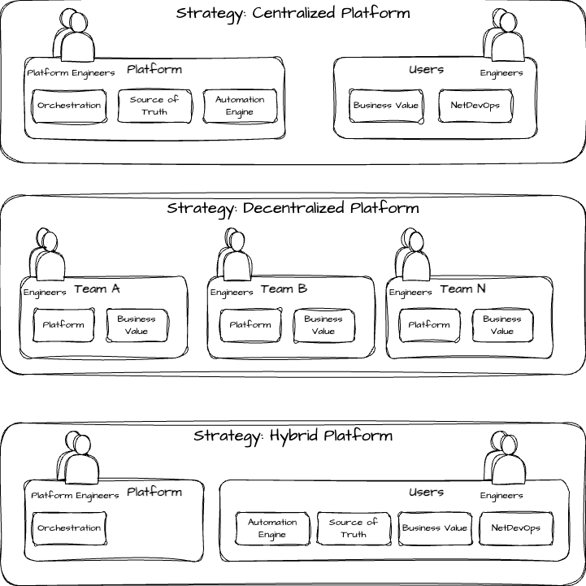

# Network Automation Strategies

A strategy is how your organization is structured which will dictate your strategy or may require an organizational update to adhere to the selected strategy.

- **Centralized Platform**: This will typically have a larger team or organization that will maintain the tools and components within the Network Automation Platform. Your customers in turn are engineers who utilize the platform to accomplish business objects by building automation and self service automation. This allows the platform organization to understand the needs of customers and the lifecycle of the platform such as bug fixes or new feature requests of the platform.
- **Decentralized Platform**: Each team will have their own automation platform and these may or may not look similar, but each team is responsible for managing their automation platform, but have full control.
- **Hybrid Platform**: This will be a mixture of **both** of the above strategies, but the mixture will look different in each organization.

## Strategy Comparison

| Objective | Centralized Platform | Decentralized Platform | Hybrid Platform |
| --------- | -------------------- | ---------------------- | --------------- |
| Allow users of the platform to focus on business value | :white_check_mark: | :warning: | :x: |
| Allows individual teams to have more control over the platform | :x: | :white_check_mark: | :warning: |
| Minimizes scope of managed platform components but not completely | :x: | :x: | :white_check_mark: |
