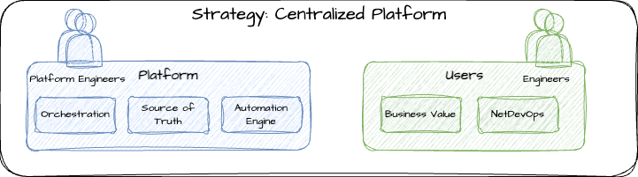

# Strategy: Centralized

## Overview

This strategy is typically geared towards larger organizations that may already have a tool or platform team. It is important to work with their leadership with what your high level objectives are and see if they can accommodate new use-cases and potentially new tooling.

The centralized strategy will allow your network engineers to focus on consuming the platform rather than building and managing your own platform. Increasing the efficiency with current network engineers with minimal upskilling is most ideal and allows the network engineers to continue to primarily focus on networking while changing their method of how they interact with the network.

It may be worth it to create your own platform team to manage the organizations' network automation platform and may require organizational changes to accommodate this new strategy.

## Pros and Cons

| Pro/Con | Description |
| ----------------------- | ----------- |
| :white_check_mark: | Allows minimal upskilling for network engineers |
| :x: | External dependencies can impede delivery of automation |
| :white_check_mark: | Utilize existing platform capabilities and not reinvent the wheel |
| :white_check_mark: | Remain focused on organizations' core strengths |
| :x: | Increased complexity due to accounting for a large number of use-cases |
| :x: | Blast radius increases as the more organizations and users are on-boarded into the platform |
