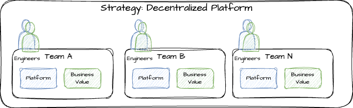

# Strategy: Decentralized

This strategy can be common in small to medium sized enterprises, but could also thrive in large corporations that operate heavily in silos.

A common reason why this strategy is chosen is to be able to increase agility in each team and allow them to manage their own platform rather than getting stuck in bureaucracy that the **centralized** strategy typically manifests. This strategy can foster innovation and if the information is dispersed, can benefit many other organizations organically.

## Pros and Cons

| Pro/Con | Description |
| ----------------------- | ----------- |
| :white_check_mark: | Allows each team full control of the tools in their platform |
| :x: | Typically requires teams to split into an infrastructure vs engineer and has less engineers delivering business value |
| :white_check_mark: | Avoids bureaucracy at the cost of maintenance of the platform |
| :x: | Potentially displaces priority and evolves into "Robbing Peter to pay Paul" situation |
