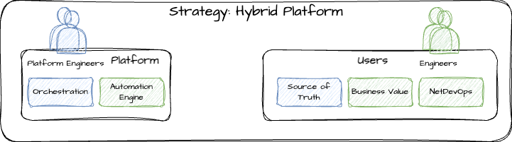

# Strategy: Hybrid

This will most likely be where most organizations will fall under as most organizations will offer some components that are valuable across normal domains such as Ansible that excels at configuration management for servers and network devices and one team may be responsible for managing Ansible for all organizations. This still requires teams to manage some components only they care about or provides a layer above their domain to provide it as a service.

## Pros and Cons

| Pro/Con | Description |
| ----------------------- | ----------- |
| :white_check_mark: | Utilize existing platform capabilities and not reinvent the wheel |
| :x: | Typically requires teams to split engineers vs infrastructure reducing efficiency |
